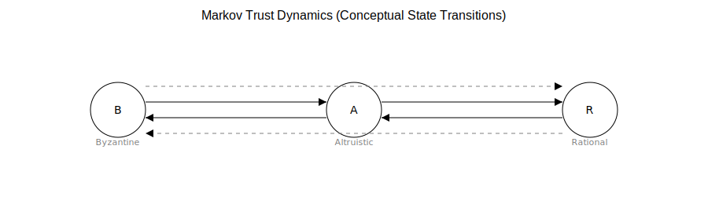

# BAR Dynamics and Decentralized Trust Systems

  

This repository explores the modeling of trust, coordination, and resilience in decentralized systems under adversarial conditions. It builds on research presented at the RSA Conference (RSAC) Security Scholar Program and serves as a foundation for ongoing work in simulation, formal methods, and distributed systems analysis.

---

## Overview

Modern distributed systems operate in environments where participants are not uniformly rational or cooperative. This work studies systems composed of:

- **Byzantine agents** — arbitrary or adversarial behavior  
- **Altruistic agents** — protocol-following, system-supporting behavior  
- **Rational agents** — utility-maximizing behavior  

Together, these form **BAR (Byzantine–Altruistic–Rational) systems**, which provide a more realistic model of decentralized coordination than classical assumptions of fully rational agents.

This repository investigates how trust, reputation, and coordination emerge in such systems using:

- Probabilistic modeling  
- Markovian dynamics  
- Game-theoretic frameworks  
- Simulation-based analysis  

---

## On Equilibrium: Extension vs. Refinement

A key clarification in this work:

The BAR framework is **not a refinement of Nash Equilibrium in the traditional game-theoretic sense** (i.e., it does not restrict the equilibrium set through stronger solution concepts such as subgame perfection or trembling-hand perfection).

Instead, it is better understood as an **extension of equilibrium modeling**:

- It expands the agent model beyond purely rational actors  
- It incorporates heterogeneous behavioral types (Byzantine, altruistic, rational)  
- It reflects real-world distributed systems where adversarial and cooperative behaviors coexist  

In this sense, it can be viewed as a *systems-level refinement*—improving realism and robustness in equilibrium modeling—rather than a formal refinement within classical game theory.

---

## Note on Prior Citations

Earlier versions of this work cited BAR-related results from a preprint (Reynouard et al., 2024). Those results have since appeared in a peer‑reviewed publication in *Games and Economic Behavior* (Gorelkina et al., 2025).

This repository now reflects the updated status of the research and situates BAR dynamics within the broader, evolving literature.

**Published version:**  
Gorelkina, O., Laraki, R., & Reynouard, M. (2025). BAR Nash equilibrium and application to blockchain design. *Games and Economic Behavior*. https://doi.org/10.1016/j.geb.2025.09.008

**Preprint version:**  
Reynouard, M., Laraki, R., & Gorelkina, O. (2024, January). BAR Nash equilibrium and application to blockchain design. *HAL Open Science*. https://doi.org/10.48550/arXiv.2401.16856

---

## Repository Structure
- docs/ Research artifacts (including RSAC poster)
- simulations/ Python-based models (planned)
- formal/ Lean4 and Haskell explorations (in progress)
- assets/ Diagrams and visual materials

---

## Research Direction

This repository serves as a staging ground for:

- Simulation of trust and reputation dynamics in decentralized systems  
- Exploration of equilibrium behavior under adversarial conditions  
- Connections between game theory, distributed systems, and formal methods  
- Early-stage work in formal verification and type-theoretic modeling  

---

## Status

This is an **active and evolving research repository**.  
Some components are exploratory and under development.

---

## Future Work

- Markov-based reputation system simulations (Python)  
- Formal modeling of coordination dynamics (Lean4)  
- Functional representations of system dynamics (Haskell)  
- Integration of simulation results with theoretical frameworks  

---

## Author

Ramamurthy Sundar